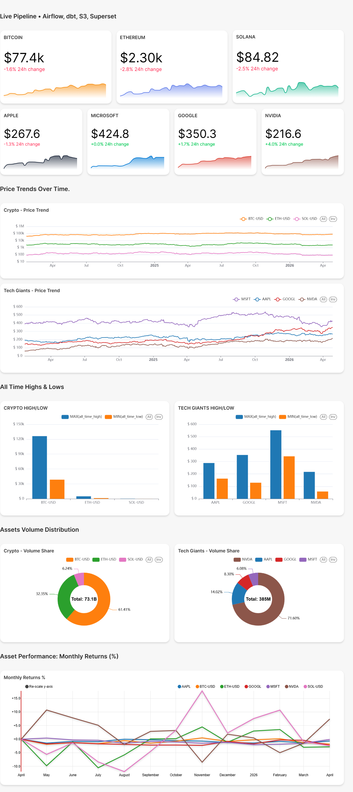

# Financial Data Pipeline 

End-to-end financial data pipeline tracking Tech Giants & Crypto — built with Apache Airflow, dbt, PostgreSQL, AWS S3, and Apache Superset.

## Overview
This pipeline automatically fetches daily stock and cryptocurrency data for 7 assets (AAPL, GOOGL, MSFT, NVDA, BTC-USD, ETH-USD, SOL-USD), transforms it using dbt, stores it in PostgreSQL, exports to AWS S3, and visualizes it in Apache Superset.

## Dashboard Preview

> Screenshot of the Apache Superset dashboard showing price trends, daily returns, and asset summaries. A live version is not currently hosted but can be run locally using the setup instructions below.

## Architecture


## Tech Stack
- **Orchestration:** Apache Airflow 3.2.0
- **Transformation:** dbt Core 1.9.0
- **Database:** PostgreSQL 16
- **Cloud Storage:** AWS S3
- **Visualization:** Apache Superset 3.1.0
- **Containerization:** Docker & Docker Compose
- **Language:** Python 3.13

## Assets Tracked
| Asset | Type | Exchange |
|-------|------|----------|
| AAPL | Stock | NASDAQ |
| GOOGL | Stock | NASDAQ |
| MSFT | Stock | NASDAQ |
| NVDA | Stock | NASDAQ |
| BTC-USD | Crypto | 24/7 |
| ETH-USD | Crypto | 24/7 |
| SOL-USD | Crypto | 24/7 |

## Pipeline Flow
1. **Fetch** — Airflow fetches daily OHLCV data from yfinance API
2. **Store** — Raw data stored in PostgreSQL with duplicate checks
3. **Transform** — dbt builds staging and mart models
4. **Test** — dbt runs data quality tests (not null, unique, accepted values)
5. **Export** — Transformed data exported to AWS S3 as CSV
6. **Visualize** — Apache Superset reads from PostgreSQL dbt models

## dbt Models
### Staging
- `stg_stock_price` — cleans raw data, selects relevant columns

### Marts
- `daily_returns` — calculates daily return % per asset using LAG window function
- `price_summary` — aggregates all time high/low, avg close, avg volume per asset

## Dashboard
The Superset dashboard includes:
- KPI cards — latest close price per asset
- Price trends over time — line chart with all 7 assets
- Daily returns % — bar chart (green = positive, red = negative)
- Best performing assets — horizontal bar chart ranked by return
- Trading volume over time — volume bar chart
- Crypto vs Stocks comparison

> To add your own dashboard screenshot: take a screenshot of your Superset dashboard, save it as `assets/dashboard.jpg` in the project root, and it will display automatically in this README.

## Setup

### Prerequisites
- Docker & Docker Compose
- AWS account with S3 bucket
- Python 3.13+

### Installation

1. Clone the repo
```bash
git clone https://github.com/Anabelmara18/financial-data-pipeline.git
cd financial-data-pipeline
```

2. Copy environment file
```bash
cp .env.example .env
```

3. Fill in your credentials in `.env`:
```bash
POSTGRES_USER=airflow
POSTGRES_PASSWORD=airflow
POSTGRES_HOST=postgres
POSTGRES_PORT=5432
POSTGRES_DB=airflow

AWS_ACCESS_KEY_ID=your_key
AWS_SECRET_ACCESS_KEY=your_secret
AWS_BUCKET_NAME=your_bucket
AWS_REGION=your_region

SUPERSET_SECRET_KEY=your_secret_key
```

4. Start the pipeline
```bash
docker compose up -d
```

5. Initialize Superset
```bash
docker exec -it newproject-superset-1 superset db upgrade
docker exec -it newproject-superset-1 superset fab create-admin \
    --username admin --firstname Admin --lastname User \
    --email admin@example.com --password admin123
docker exec -it newproject-superset-1 superset init
```

6. Access services:
- Airflow: `http://localhost:8080` (username: airflow, password: airflow)
- Superset: `http://localhost:8088` (username: admin, password: admin123)

## Project Structure
```text
financial-data-pipeline/
├── dags/
│   └── pipeline_dags.py       # Airflow DAG (fetch → dbt → test → S3)
├── data_ingestion/
│   ├── fetch_data.py          # yfinance ingestion script
│   └── export_to_s3.py        # S3 export script
├── finance_dbt/
│   └── models/
│       ├── staging_models/
│       │   ├── sources.yml
│       │   └── stg_stock_price.sql
│       └── mart_models/
│           ├── schema.yml
│           ├── daily_returns.sql
│           └── price_summary.sql
├── assets/
│   └── dashboard.jpg          # ← add your dashboard screenshot here
├── docker-compose.yaml
├── .env.example
└── README.md
```

## Key Engineering Decisions
- **yFinance** chosen over Twelve Data after evaluating data quality gaps
- **PostgreSQL** used as both raw and transformed data store
- **dbt** handles all transformations with built-in testing
- **Docker Compose** ensures reproducible local and cloud deployment
- **Duplicate prevention** implemented using date + ticker composite check before each insert

## Future Improvements
- Deploy to AWS EC2 for always-on pipeline
- Add Apache Spark for large scale processing
- Integrate Kafka for real-time streaming
- Migrate to Snowflake or BigQuery as data warehouse
- Add Power BI dashboard for wider accessibility

## Author
Built by Francisca — Data Engineering Portfolio Project
[LinkedIn](https://www.linkedin.com/in/amankwe-amarachi/) | [GitHub](https://github.com/Anabelmara18)